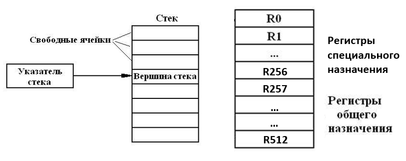

# «Edem-VM»
## Спецификация виртуальной машины
---
### Общие сведения
**Edem-VM** – простейшая виртуальная машина, предназначенная для работы с целыми числами и символами. Предусматривает операторы ветвления, циклы и массивы размерностью до 256 полей.

### Модель вычислений
Данная VM может использовать как стековую модель вычислений, так регистровую. Инструкции для работы с ними приведены ниже.


### Модель памяти
Данные и промежуточные результаты будут опционально хранится либо в стеке (размер стека - 512 полей), либо в одном из 512 регистров, доступных для хранения данных, причем первые 256 регистров специального назначения для функций, доступ к этим регистрам не ограничен, но перед вызовом и после завершения функции они обнуляются. Из данного утверждения следует, что при вызове из функции другой функции, данные старой функции не сохранятся (для их сохранения, следует поместить данные на стек).

| Номера регистров | Назначение регистров |
| :--------: | :--------: |
| 0   | Регистр для хранения вершины стека  |
| 1 - 256  | Регистры доступные для функций, исполняемых в данный момент. После завершения функции, данные регистры обнуляются  |
| 257 - 511   | Регистр для хранения вершины стека  |

    !!! По умолчанию значения всех регистров равны 0 !!!

## Набор инструкций
---
#### Для работы со стеком
| Название инструкций | Мнемоника | Описание инструкции |
|:--------------------|:----------|:--------------------|
| Add | Add <vl> | Добавляет на вершину стека <vl>.  |
| Print | Print | Вывод верхнего элемента стека на экран. |
| Pop | Pop <reg> | Копирует верхний элемент стека в регистр reg. |
| Sum | Sum | Cложение двух верхних элементов и запись результата обратно в стек. |
| Pow | Pow | Умножение двух верхних элементов и запись результата обратно в стек. |
| Div | Div | Целочисленное деление второго элемента на первый и запись результата обратно в стек. |
| Diff | Diff | Вычитание из второго элемента первого и запись результата обратно в стек. |

#### Для работы с регистрами
| Название инструкций | Мнемоника | Описание инструкции |
|:--------------------|:----------|:--------------------|
| R | R-<number> | Обращается к значению регистра <number>  |
| RAdd | RAdd <reg> <vl> | Записывает значение value в регистр по номеру reg. |
| RPrint | RPrint <reg> | Выводит на экран значение регистра по номеру reg. |
| RSum | RSum <vl-1> <vl-2> <reg> | Суммирует значения <vl-1>, <vl-2> и записывает результат в <reg>. |
| RPow | RPow <vl-1> <vl-2> <reg> | Умножает значение <vl-1>, <vl-2> и записывает результат в <reg>. |
| RDiv | RDiv <vl-1> <vl-2> <reg> | Осуществляет целочисленное деление <vl-1> на <vl-2> и записывает результат в <reg>. |
| RDiff | RDiff <vl-1> <vl-2> <reg> | Вычитает значение <vl-2> из <vl-1> и записывает результат в <reg>. |

#### Организация ветвлений
| Название инструкций | Мнемоника | Описание инструкции |
|:--------------------|:----------|:--------------------|
| **If, else** | IF <(condition)>  {Operators-true}  {Operators-false} | Выше представлена схема ветвлений. Если condition=true выполняется инструкция на следующей стоке за условием. Если condition=false выполняется инструкция через строку от условия. |

#### Организация циклов
| Название инструкций | Мнемоника | Описание инструкции |
|:--------------------|:----------|:--------------------|
| **While** | While <(condition)> { Operator1 Operator2} | Операторы в фигурных скобках (Operator1, Operator2) выполняются до тех пор, пока условие <(condition)>, не станет ложным |

#### Безусловный переход
| Название инструкций | Мнемоника | Описание инструкции |
|:--------------------|:----------|:--------------------|
| **goto** | label-<number> goto-<number> | Оператор безусловного перехода. Переводит (goto) интерпретатор на строку с определенной меткой(label). |

#### Специальные символы
| Название инструкций | Мнемоника | Описание инструкции |
|:--------------------|:----------|:--------------------|
| Коммент. | // | Строка после этого символа не читается компилятором. |
| # | #<value> | Распознавать value, как код символа. |

#### Работа с файлами
| Название инструкций | Мнемоника | Описание инструкции |
|:--------------------|:----------|:--------------------|
| AlgRead | AlgRead <path> | Читает алгоритм из файла по пути path |
| ValWrite | ValWrite <path> <reg> | Сохраняет значение из регистра reg по пути path. |
| ValRead | ValRead <path> <reg> | Читает файл по пути path и сохраняет первое корректное значение в регистр reg. |
| StWrite | StWrite <path> | Cохраняет верхнее значение стека в файл по пути path. |

>*Если у инструкции несколько аргументов, все они передаются через пробел.

>** Под <vl> подразумевается либо число, либо значение регистра (R-<number>),

>*** Под <reg> подразумевается только значение регистра (R-<number>).

>**** Под <number> подразумевается целое число, либо значение какого-либо регистра (конструкция вида – R-R-5 (обращение к регистру, номер которого находится в ячейки 5), считается корректной).


### Режим адресации
**Непосредственная адресация** – данные для инструкции входят в саму инструкцию.

>Загрузка и получение данных производится с помощью специальных инструкций.

>Данные могут быть заданы как непосредственно в самом коде алгоритма, так и прочитаны из файла.

### Форма записи алгоритма
Алгоритм подается на стандартный поток чтения либо загружается из файла целиком (не по 1 инструкции). Инструкции располагаются каждая на новой строке. Если компилятор обнаруживает ошибку в инструкции или инструкция ему не известна, исполнение алгоритма не завершается, но выводится сообщение об ошибки. Данная строка в свою очередь просто игнорируется исполнителем.

## Мнемоническое представление программ
---
##### Представление функций
 1. Каждое **описание новой функции** начинается с ключевого слова `func`, далее через дефис идет имя функции.

 2. **Аргументы** для своей работы функция берет с вершины стека.
 3. Далее на M строках, каждая из которых начинается с символа `_` (подчеркивание) идут **инструкции** этой функции.
 4. **Результат** своей работы, функция записывает на вершину стека, либо изменяет данные в зависимости от своей логики и назначения.
 5. Для **вызова функции** необходимо указать уникальный идентификатор функции, перед этим поместив на стек необходимое количество параметров.
 >**Примечание**: не безопасно вызывать функцию, предварительно не поместив на стек необходимое количество аргументов. Если в стеке окажется меньше аргументов, чем требуется функции, программа завершится с ошибкой.

**Пример :**
```
func-1
	_Pop R-1
	_Pop R-2
	_RAdd R-1 R-2 R-3
	_Add R-3
	_Print
```
Функция сохраняет 2 значения со стека в специальные регистры 1 и 2, в регистр 3 записывает их сумму. Возвращает данную сумму на стек и выводит ее на экран.

##### Представления алгоритма
 * Каждая инструкция алгоритма записывается на новой строке.
 * Для выделения блоков инструкций используются:
`{` – для начала блока инструкций
`}` – для окончания блока инструкций


# Фибоначчи
>>>Реализация функции для VM-Edem, принимающей на вход N (считывает со стека)
и вычисляющей N-ое число Фибоначчи (результат записывает на стек и выводится на экран).
```
_func fibonacci
_RAdd 1 1 // в 1 спец. регистре будет счетчик
_Pop 2 // сохраняем со стека аргумент в регистр 2
_RAdd 3 1 // первое число Фибоначчи в регистр 3
_RAdd 4 1 // второе число Фибоначчи в регистр 4

// основное ветвление-цикл
_label 0
_if R-1 < R-2 // проверяем не дошли ли до нужного числа
_goto 1 // если нет, то идем в блок вычислений
_goto 2 // если да, то идем в блок выводы

// блок для вычисления следующего числа
_label 1
_RSum R-3 R-4 4 // вычисляем следующее число Фибоначчи
_RDiff R-4 R-3 3 // сохраняем предыдущее число
_RSum R-1 1 1 // увеличиваем переменную счетчик на 1
_goto 0 // возвращаемся к проверке условия

// блок для вывода результата
_label 2
_Add R-4 // помещаем значение регистра 4 на стек
_Print // выводим на экран значение с вершины стека


// вызов функции из основной программы
Add 36 // помещаем на вершину стека аргумент для функции
func fibonacci // вызываем функцию
```

# Сортировка выбором
>>>Реализация функции для VM-Edem, принимающей на вход N1, N2 и сортирующий
значения регистров в диапазоне от N1 до N2, алгоритмом сортировкой выбором.
```
_func selectionsort
_Pop 2 // читаем со стека верхнюю границу в регистр 2
_Pop 1 // читаем со стека нижнюю границу в регистр 1
_RAdd 3 R-1 //в регистре 3 храним номер текущего эл-та
_RAdd 4 R-1 //в регистре 4 храним номер максимального //элемента, найденного за итерацию цикла
_RAdd 5 0 //регистр 5 является промежуточной переменной, //для перемещения значений регистров

//цикл с основным условием
_label 0
_if R-3 < R-2 //если в пределах границы сортировки
_goto 1 //проверяем не наибольший ли это элемент
_goto 2 //если граница сортировки, проверяем на наибольший и меняем местами элементы (+уменьшаем гран.)

//проверяем текущий элемент на максимум
_label 1
_if R-R-3 > R-R-4 //если данный элемент максимальный
_RAdd 4 R-3 //сохраняем номер нового максимального
_RAdd 5 0 //пустое действие для else
_RSum R-3 1 3 //берем следующий элемент для проверки
_goto 0 //возвращаемся к основному циклу

//сравниваем с последним элементом
_label 2
_if R-R-3 < R-R-4 //если данный элемент НЕ максимальный
_{
_RAdd 5 R-R-3 //запоминаем значение на границе
_RAdd R-3 R-R-4 //записываем максим. в элемент на границе
_RAdd R-4 R-5 //сохраняем старое значение
_}
_RAdd 5 0 //пустое действие для else
//возвращаем инвариант цикла
_RDiff R-2 1 2 //уменьшаем верхнюю границу (так как там //уже оказалось максимальное значение)
_RAdd 3 R-1 //обнуляем «счетчик цикла»
_RAdd 4 R-1 //«обнуляем» максимальный элемент
 _if R-1 <> R-2 //проверяем не сомкнулись ли границы
 _goto 0 //если нет, возвращаемся к основному циклу
 _RAdd 5 0 //если да, значит диапазон отсортирован
 

// вызов функции из основной программы
// заполняем регистры значениями
RAdd 350 34
RAdd 351 75
RAdd 352 29
RAdd 353 3
RAdd 354 18
RAdd 355 724
Add 350 // помещаем на стек нижнюю границу сортировки
Add 355 // помещаем на стек верхнюю границу сортировки
func selectionsort // вызываем функцию
// после завершения функции в данном диапазоне будут //отсортированные значения
```
